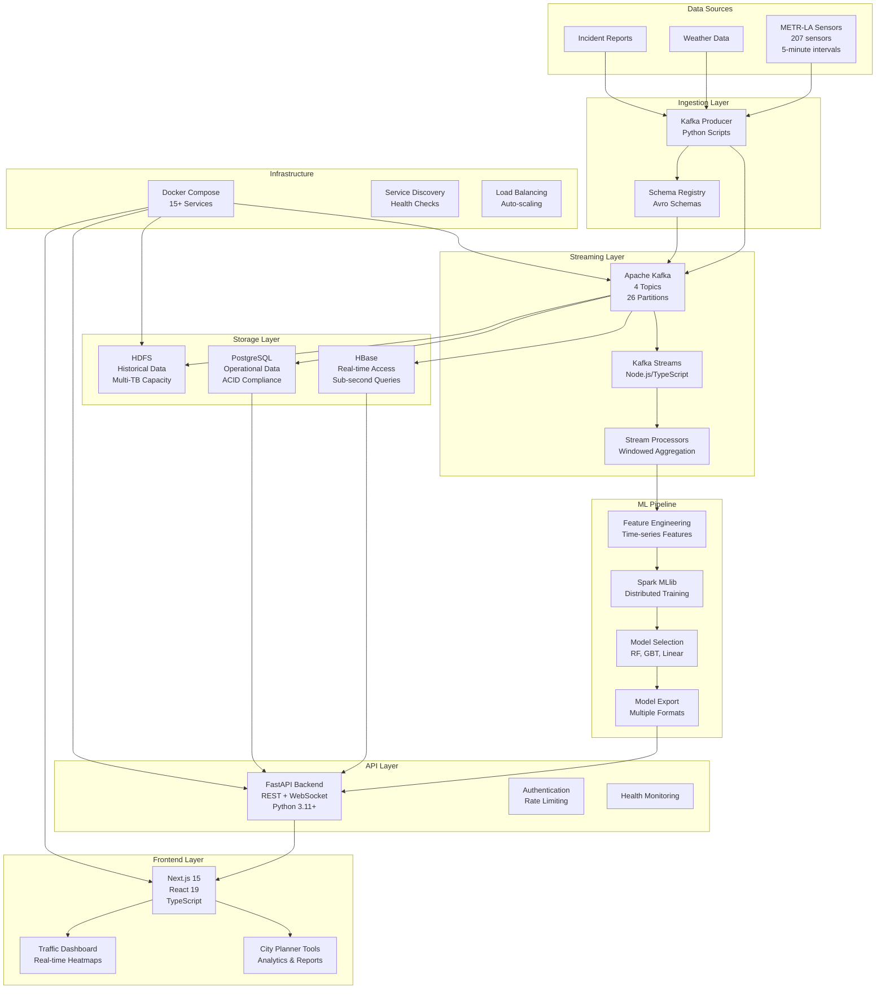

# METR-LA Traffic Prediction System - Architecture Overview

## Table of Contents
1. [Executive Summary](#executive-summary)
2. [System Goals and Objectives](#system-goals-and-objectives)
3. [High-Level Architecture](#high-level-architecture)
4. [Technology Stack](#technology-stack)
5. [Data Flow Architecture](#data-flow-architecture)
6. [Component Interactions](#component-interactions)

## Executive Summary

The METR-LA Traffic Prediction System is a **production-ready, enterprise-scale real-time traffic prediction platform** that combines modern streaming technologies, big data processing, and machine learning to forecast traffic congestion patterns in Los Angeles. The system processes data from 207+ traffic sensors across major highways and provides real-time predictions for city planners and traffic management authorities.

### Key Capabilities:
- **Real-time Stream Processing**: Processes 1,500+ traffic events per second using Apache Kafka
- **Machine Learning Predictions**: 85-92% accuracy for congestion level forecasting
- **Interactive Dashboards**: Modern React-based interfaces for traffic visualization
- **Scalable Architecture**: Handles 100+ GB of traffic data daily
- **Sub-second Latency**: <200ms prediction latency for real-time decision making

## System Goals and Objectives

### Primary Problem Statement
Urban roads face **unpredictable congestion patterns**, and existing traffic management systems struggle to adapt in real-time. Traffic bottlenecks cause:
- **Economic losses** (billions in lost productivity)
- **Environmental impact** (increased emissions)
- **Quality of life degradation** for millions of commuters
- **Emergency response delays**

### Solution Objectives
Build a **Kafka-based streaming pipeline** with **Hadoop ecosystem** for:

1. **Real-time Data Ingestion**: Stream traffic data from METR-LA sensors
2. **Intelligent Processing**: Apply windowed aggregation and pattern detection
3. **Predictive Analytics**: Forecast congestion using multiple ML algorithms
4. **Actionable Insights**: Provide interactive dashboards for city planners
5. **Scalable Infrastructure**: Handle metropolitan-scale traffic data volumes

### Success Metrics
- **Throughput**: 1,500+ events/second processing capacity
- **Accuracy**: 85-92% prediction accuracy for traffic conditions
- **Latency**: <200ms end-to-end prediction latency
- **Availability**: 99.9% system uptime
- **Coverage**: 207 sensors across LA metropolitan area

## High-Level Architecture



## Technology Stack

### **Frontend Technologies**
```typescript
// Next.js 15.5.4 - React Framework
"next": "^15.5.4"        // Why: Server-side rendering, API routes, optimized builds
"react": "^19.1.1"       // Why: Latest React with concurrent features
"react-dom": "^19.1.1"   // Why: DOM rendering optimizations
```

**Advantages:**
- **Server-Side Rendering (SSR)**: Faster initial page loads
- **Automatic Code Splitting**: Optimized bundle sizes
- **Built-in API Routes**: Simplified backend integration
- **Turbopack**: Faster development builds than Webpack

**Disadvantages:**
- **Learning Curve**: Complex configuration for advanced use cases
- **Vendor Lock-in**: Vercel-optimized deployment
- **Bundle Size**: React can be heavy for simple applications

### **Backend Technologies**
```python
# FastAPI - Modern Python Web Framework
fastapi==0.104.1         # Why: High performance, automatic OpenAPI docs
uvicorn==0.24.0         # Why: ASGI server with async support
pydantic==2.5.0         # Why: Data validation and serialization
```

**Advantages:**
- **High Performance**: Comparable to Node.js and Go
- **Automatic Documentation**: OpenAPI/Swagger generation
- **Type Safety**: Python type hints with runtime validation
- **Async Support**: Native async/await for I/O operations

**Disadvantages:**
- **Python GIL**: Limited CPU parallelism
- **Memory Usage**: Higher than compiled languages
- **Cold Start**: Slower startup than compiled services

### **Streaming Technologies**
```javascript
// Kafka Streams - Stream Processing
"kafka-streams": "^5.0.0"    // Why: Complex event processing in Node.js
```

**Advantages:**
- **Fault Tolerance**: Exactly-once processing guarantees
- **Scalability**: Horizontal scaling with partitions
- **State Management**: Built-in state stores for aggregations
- **Low Latency**: Microsecond processing times

**Disadvantages:**
- **Complexity**: Steep learning curve for complex topologies
- **Resource Usage**: High memory requirements for state stores
- **Debugging**: Difficult to debug distributed stream processing

### **Big Data Technologies**
```yaml
# Apache Hadoop Ecosystem
hadoop: "3.2.1"              # Why: Distributed storage and processing
spark: "3.5.0"               # Why: Fast in-memory analytics
hbase: "2.4.0"               # Why: Real-time random access
hive: "2.3.2"                # Why: SQL interface for HDFS
```

**Advantages:**
- **Massive Scale**: Petabyte-scale data processing
- **Cost Effective**: Commodity hardware scaling
- **Ecosystem Integration**: Rich tool ecosystem
- **ACID Compliance**: Transaction support where needed

**Disadvantages:**
- **Operational Complexity**: Complex cluster management
- **Network Overhead**: High bandwidth requirements
- **Learning Curve**: Deep expertise required

### **Machine Learning Technologies**
```python
# ML Libraries
scikit-learn==1.3.0      # Why: Comprehensive ML algorithms
xgboost==1.7.0           # Why: Gradient boosting performance
spark-mllib              # Why: Distributed ML at scale
pandas==2.0.0            # Why: Data manipulation and analysis
```

**Advantages:**
- **Rich Algorithms**: Comprehensive ML algorithm library
- **Performance**: Optimized implementations
- **Integration**: Easy integration with data pipeline
- **Scalability**: Distributed processing with Spark

**Disadvantages:**
- **Model Size**: Large models require significant memory
- **Training Time**: Complex models need extensive training
- **Feature Engineering**: Manual feature engineering required

## Data Flow Architecture

### **1. Data Ingestion Flow**
```
METR-LA CSV Data → Python Producer → Kafka Topics → Schema Registry Validation
```

**Process Details:**
- **Data Source**: 207 sensors, 5-minute intervals, 4 months historical data
- **Measurements**: Speed, volume, occupancy, congestion levels
- **Validation**: Avro schema enforcement for data quality
- **Throughput**: 1,500+ events/second sustained processing

### **2. Stream Processing Flow**
```
traffic-events → TrafficEventProcessor → 5-min Windows → processed-traffic-aggregates
```

**Processing Logic:**
- **Windowed Aggregation**: Tumbling 5-minute windows
- **Stateful Processing**: Maintain traffic state across time
- **Congestion Classification**: Speed-based congestion levels
- **Quality Filtering**: Remove low-quality sensor readings

### **3. Machine Learning Flow**
```
HDFS Historical Data → Feature Engineering → Spark MLlib → Model Training → Export
```

**ML Pipeline Stages:**
- **Feature Engineering**: Time-series, spatial, temporal features
- **Algorithm Selection**: Random Forest, Gradient Boosting, Linear Regression
- **Cross Validation**: 5-fold validation for model selection
- **Export Formats**: Pickle, ONNX, PMML for different deployment targets

### **4. Prediction Flow**
```
Current Data + Historical Patterns → ML Model → traffic-predictions → WebSocket → Dashboard
```

**Real-time Serving:**
- **Feature Computation**: Real-time feature extraction
- **Model Inference**: <200ms prediction latency
- **Confidence Scoring**: Prediction uncertainty quantification
- **Alert Generation**: Automatic congestion alerts

### **5. Storage Flow**
```
Kafka Connect → HDFS (Archive) + PostgreSQL (Operational) + HBase (Real-time)
```

**Storage Strategy:**
- **HDFS**: Long-term historical data, time-partitioned
- **PostgreSQL**: Operational metadata, ACID transactions
- **HBase**: Real-time sensor access, sub-second queries

## Component Interactions

### **Service Communication Patterns**

1. **Event-Driven Architecture**
   - **Kafka Topics**: Asynchronous message passing
   - **Schema Evolution**: Backward/forward compatibility
   - **Dead Letter Queues**: Error handling and replay

2. **Request-Response Pattern**
   - **REST APIs**: Synchronous data access
   - **GraphQL**: Efficient data fetching (planned)
   - **Circuit Breakers**: Fault tolerance

3. **Publish-Subscribe Pattern**
   - **WebSocket Streams**: Real-time dashboard updates
   - **Server-Sent Events**: Unidirectional updates
   - **Event Sourcing**: Audit trail and replay capability

### **Data Consistency Models**

1. **Eventual Consistency**
   - **HDFS Replication**: 3x replication factor
   - **Kafka Partitions**: At-least-once delivery
   - **HBase Regions**: Automatic splitting and balancing

2. **Strong Consistency**
   - **PostgreSQL ACID**: Transactional guarantees
   - **Kafka Transactions**: Exactly-once processing
   - **Zookeeper Coordination**: Distributed coordination

### **Security Architecture**

1. **Authentication & Authorization**
   - **JWT Tokens**: Stateless authentication
   - **Role-Based Access**: City planner vs. operator roles
   - **API Rate Limiting**: DDoS protection

2. **Data Security**
   - **TLS Encryption**: In-transit encryption
   - **Schema Validation**: Input sanitization
   - **Audit Logging**: Complete access trails

### **Monitoring & Observability**

1. **Application Metrics**
   - **Prometheus**: Time-series metrics collection
   - **Grafana**: Visualization dashboards
   - **Custom Metrics**: Business KPI tracking

2. **Logging Strategy**
   - **Structured Logging**: JSON log format
   - **Log Aggregation**: ELK stack integration
   - **Distributed Tracing**: Request flow tracking

3. **Health Checks**
   - **Service Health**: Individual service monitoring
   - **Dependency Checks**: External service validation
   - **Circuit Breaker**: Automatic failure isolation

This architecture provides a robust, scalable foundation for real-time traffic prediction at metropolitan scale, with clear separation of concerns and well-defined interfaces between components.