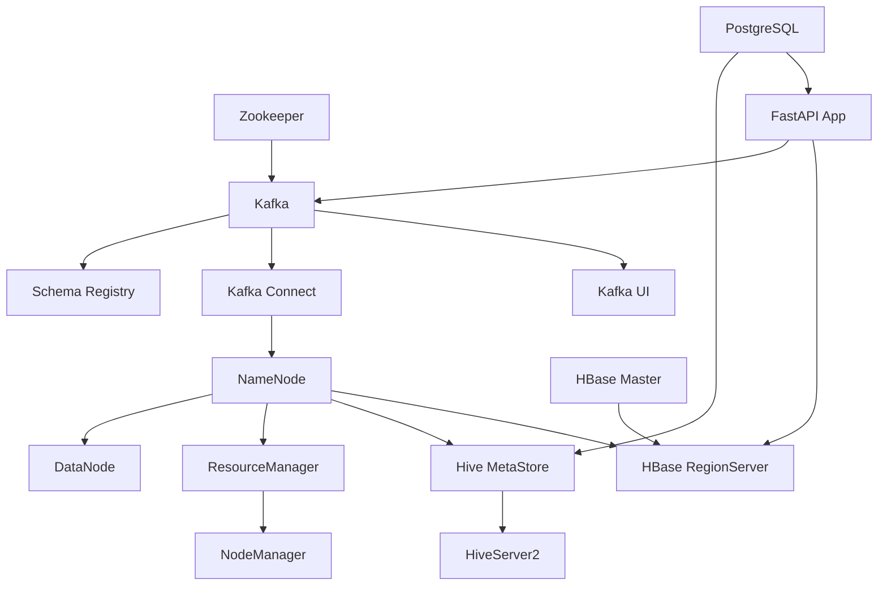

# METR-LA Traffic Prediction System - Infrastructure & Deployment Analysis

## Table of Contents
1. [Infrastructure Architecture Overview](#infrastructure-architecture-overview)
2. [Docker Compose Orchestration](#docker-compose-orchestration)
3. [Hadoop Ecosystem Configuration](#hadoop-ecosystem-configuration)
4. [Kafka Configuration and Setup](#kafka-configuration-and-setup)
5. [PowerShell Automation Scripts](#powershell-automation-scripts)
6. [Monitoring and Observability](#monitoring-and-observability)

## Infrastructure Architecture Overview

The system uses **Docker Compose** to orchestrate **15+ microservices** in a production-like environment:

### **Service Dependency Graph**



**Why This Architecture:**
- **Microservices**: Independent scaling and deployment
- **Service Discovery**: Docker networking for service communication
- **Data Pipeline**: Clear data flow from ingestion to serving
- **Fault Tolerance**: Service independence prevents cascade failures

## Docker Compose Orchestration

### **Main Docker Compose File Analysis (docker-compose.yml)**

```yaml
version: '3.8'

networks:
  traffic-prediction-network:
    driver: bridge
    ipam:
      config:
        - subnet: 172.20.0.0/16
```

**Network Configuration Analysis:**
- **Custom Network**: Isolated network for service communication
- **Bridge Driver**: Default Docker networking with DNS resolution
- **Custom Subnet**: Explicit IP range for predictable addressing
- **Service Discovery**: Services communicate by name resolution

### **Zookeeper Service Configuration**

```yaml
services:
  zookeeper:
    image: confluentinc/cp-zookeeper:7.4.0
    hostname: zookeeper
    container_name: zookeeper
    ports:
      - "2181:2181"
    environment:
      ZOOKEEPER_CLIENT_PORT: 2181
      ZOOKEEPER_TICK_TIME: 2000
      ZOOKEEPER_SYNC_LIMIT: 2
    networks:
      - traffic-prediction-network
    volumes:
      - zookeeper-data:/var/lib/zookeeper/data
      - zookeeper-logs:/var/lib/zookeeper/log
    restart: unless-stopped
    healthcheck:
      test: ["CMD", "bash", "-c", "echo 'ruok' | nc localhost 2181 | grep imok"]
      interval: 30s
      timeout: 10s
      retries: 3
```

**Zookeeper Configuration Analysis:**

**Why Zookeeper:**
- **Kafka Dependency**: Kafka requires Zookeeper for cluster coordination
- **Configuration Management**: Stores Kafka cluster metadata
- **Leader Election**: Manages Kafka broker leadership
- **Service Discovery**: Enables Kafka broker discovery

**Configuration Details:**
- **Client Port 2181**: Standard Zookeeper client port
- **Tick Time 2000ms**: Basic time unit for heartbeats
- **Sync Limit**: Follower sync timeout (2 x tick_time)
- **Health Check**: Custom health check using Zookeeper's 4-letter commands
- **Data Persistence**: Volumes for data and log persistence
- **Restart Policy**: Automatic restart unless manually stopped

### **Kafka Service Configuration**

```yaml
  kafka:
    image: confluentinc/cp-kafka:7.4.0
    hostname: kafka
    container_name: kafka
    depends_on:
      - zookeeper
    ports:
      - "9092:9092"
      - "9101:9101"
    environment:
      KAFKA_BROKER_ID: 1
      KAFKA_ZOOKEEPER_CONNECT: 'zookeeper:2181'
      KAFKA_LISTENER_SECURITY_PROTOCOL_MAP: PLAINTEXT:PLAINTEXT,PLAINTEXT_HOST:PLAINTEXT
      KAFKA_ADVERTISED_LISTENERS: PLAINTEXT://kafka:29092,PLAINTEXT_HOST://localhost:9092
      KAFKA_LISTENERS: PLAINTEXT://0.0.0.0:29092,PLAINTEXT_HOST://0.0.0.0:9092
      KAFKA_OFFSETS_TOPIC_REPLICATION_FACTOR: 1
      KAFKA_TRANSACTION_STATE_LOG_MIN_ISR: 1
      KAFKA_TRANSACTION_STATE_LOG_REPLICATION_FACTOR: 1
      KAFKA_GROUP_INITIAL_REBALANCE_DELAY_MS: 0
      KAFKA_JMX_PORT: 9101
      KAFKA_JMX_HOSTNAME: localhost
    networks:
      - traffic-prediction-network
    volumes:
      - kafka-data:/var/lib/kafka/data
    restart: unless-stopped
    healthcheck:
      test: ["CMD", "kafka-broker-api-versions", "--bootstrap-server", "localhost:9092"]
      interval: 30s
      timeout: 10s
      retries: 3
```

**Kafka Configuration Analysis:**

**Listener Configuration:**
- **PLAINTEXT://kafka:29092**: Internal container communication
- **PLAINTEXT_HOST://localhost:9092**: External client access
- **Security Protocol**: PLAINTEXT for development (SSL/SASL for production)

**Replication Settings:**
- **Replication Factor 1**: Single broker setup (increase for production)
- **Min ISR 1**: Minimum in-sync replicas for durability
- **Transaction State**: Enables exactly-once processing

**Performance Settings:**
- **Initial Rebalance Delay 0**: Faster consumer group startup
- **JMX Port 9101**: Metrics collection for monitoring

### **Schema Registry Configuration**

```yaml
  schema-registry:
    image: confluentinc/cp-schema-registry:7.4.0
    hostname: schema-registry
    container_name: schema-registry
    depends_on:
      - kafka
    ports:
      - "8081:8081"
    environment:
      SCHEMA_REGISTRY_HOST_NAME: schema-registry
      SCHEMA_REGISTRY_KAFKASTORE_BOOTSTRAP_SERVERS: 'kafka:29092'
      SCHEMA_REGISTRY_LISTENERS: http://0.0.0.0:8081
      SCHEMA_REGISTRY_KAFKASTORE_TOPIC: _schemas
      SCHEMA_REGISTRY_KAFKASTORE_TOPIC_REPLICATION_FACTOR: 1
      SCHEMA_REGISTRY_SCHEMA_COMPATIBILITY_LEVEL: BACKWARD
    networks:
      - traffic-prediction-network
    restart: unless-stopped
    healthcheck:
      test: ["CMD", "curl", "-f", "http://localhost:8081/subjects"]
      interval: 30s
      timeout: 10s
      retries: 3
```

**Schema Registry Analysis:**
- **Purpose**: Manages Avro schema evolution and compatibility
- **Kafka Store**: Uses Kafka as storage backend for schemas
- **Compatibility**: BACKWARD compatibility ensures schema evolution
- **REST API**: Port 8081 for schema management operations

### **Hadoop Ecosystem Services**

```yaml
  namenode:
    image: apache/hadoop:3.2.1
    hostname: namenode
    container_name: namenode
    ports:
      - "9870:9870"  # NameNode Web UI
      - "8020:8020"  # NameNode RPC
    environment:
      HADOOP_CONF_DIR: /opt/hadoop/etc/hadoop
      SERVICE_PRECONDITION: ""
    env_file:
      - ./hadoop.env
    volumes:
      - namenode-data:/hadoop/dfs/name
      - ./hadoop-configs:/opt/hadoop/etc/hadoop:ro
      - ./logs:/opt/hadoop/logs
    networks:
      - traffic-prediction-network
    restart: unless-stopped
    command: ["hdfs", "namenode"]
    healthcheck:
      test: ["CMD", "curl", "-f", "http://localhost:9870"]
      interval: 30s
      timeout: 10s
      retries: 5
```

**NameNode Configuration:**
- **HDFS Master**: Manages filesystem metadata
- **Web UI Port 9870**: Cluster status and file browser
- **RPC Port 8020**: Client and DataNode communication
- **Configuration Mount**: External Hadoop configuration files
- **Volume Persistence**: NameNode metadata persistence

```yaml
  datanode:
    image: apache/hadoop:3.2.1
    hostname: datanode
    container_name: datanode
    ports:
      - "9864:9864"  # DataNode Web UI
    environment:
      SERVICE_PRECONDITION: "namenode:9870"
    env_file:
      - ./hadoop.env
    volumes:
      - datanode-data:/hadoop/dfs/data
      - ./hadoop-configs:/opt/hadoop/etc/hadoop:ro
      - ./logs:/opt/hadoop/logs
    networks:
      - traffic-prediction-network
    restart: unless-stopped
    command: ["hdfs", "datanode"]
    depends_on:
      - namenode
    healthcheck:
      test: ["CMD", "curl", "-f", "http://localhost:9864"]
      interval: 30s
      timeout: 10s
      retries: 5
```

**DataNode Configuration:**
- **HDFS Worker**: Stores actual file blocks
- **Service Precondition**: Waits for NameNode availability
- **Block Storage**: Persistent volume for HDFS blocks
- **Health Check**: HTTP endpoint monitoring

### **YARN Resource Manager**

```yaml
  resourcemanager:
    image: apache/hadoop:3.2.1
    hostname: resourcemanager
    container_name: resourcemanager
    ports:
      - "8088:8088"  # ResourceManager Web UI
      - "8032:8032"  # ResourceManager RPC
    environment:
      SERVICE_PRECONDITION: "namenode:9870"
    env_file:
      - ./hadoop.env
    volumes:
      - ./hadoop-configs:/opt/hadoop/etc/hadoop:ro
      - ./logs:/opt/hadoop/logs
    networks:
      - traffic-prediction-network
    restart: unless-stopped
    command: ["yarn", "resourcemanager"]
    depends_on:
      - namenode
    healthcheck:
      test: ["CMD", "curl", "-f", "http://localhost:8088/cluster"]
      interval: 30s
      timeout: 10s
      retries: 5
```

**YARN Configuration:**
- **Resource Management**: Allocates cluster resources for applications
- **Web UI 8088**: Cluster resource usage and application tracking
- **RPC Port 8032**: Client application submission
- **Application Tracking**: Monitors MapReduce and Spark jobs

## Hadoop Ecosystem Configuration

### **Core Site Configuration (hadoop-configs/core-site.xml)**

```xml
<configuration>
    <property>
        <name>fs.defaultFS</name>
        <value>hdfs://namenode:8020</value>
        <description>The default file system URI</description>
    </property>
    
    <property>
        <name>hadoop.tmp.dir</name>
        <value>/hadoop/tmp</value>
        <description>A base for other temporary directories</description>
    </property>
    
    <property>
        <name>fs.hdfs.impl</name>
        <value>org.apache.hadoop.hdfs.DistributedFileSystem</value>
    </property>
    
    <property>
        <name>fs.file.impl</name>
        <value>org.apache.hadoop.fs.LocalFileSystem</value>
    </property>
    
    <property>
        <name>io.compression.codecs</name>
        <value>
            org.apache.hadoop.io.compress.DefaultCodec,
            org.apache.hadoop.io.compress.GzipCodec,
            org.apache.hadoop.io.compress.BZip2Codec,
            org.apache.hadoop.io.compress.SnappyCodec,
            org.apache.hadoop.io.compress.Lz4Codec
        </value>
        <description>Compression codecs for MapReduce</description>
    </property>
</configuration>
```

**Core Configuration Analysis:**
- **Default FS**: HDFS as primary filesystem
- **Tmp Directory**: Shared temporary space
- **Compression**: Multiple codecs for different use cases
- **Implementation Classes**: Explicit filesystem implementations

### **HDFS Site Configuration (hadoop-configs/hdfs-site.xml)**

```xml
<configuration>
    <property>
        <name>dfs.replication</name>
        <value>1</value>
        <description>Default block replication</description>
    </property>
    
    <property>
        <name>dfs.namenode.name.dir</name>
        <value>file:///hadoop/dfs/name</value>
        <description>Path on the local filesystem where the NameNode stores the namespace and transaction logs</description>
    </property>
    
    <property>
        <name>dfs.datanode.data.dir</name>
        <value>file:///hadoop/dfs/data</value>
        <description>Comma separated list of paths on the local filesystem of a DataNode where it should store its blocks</description>
    </property>
    
    <property>
        <name>dfs.blocksize</name>
        <value>134217728</value>
        <description>The default block size for new files (128MB)</description>
    </property>
    
    <property>
        <name>dfs.namenode.checkpoint.period</name>
        <value>21600</value>
        <description>The number of seconds between two periodic checkpoints (6 hours)</description>
    </property>
</configuration>
```

**HDFS Configuration Analysis:**
- **Replication 1**: Single node setup (increase for production)
- **Block Size 128MB**: Optimal for large files and MapReduce
- **Checkpoint Period**: Regular metadata backups every 6 hours
- **Data Directories**: Persistent storage paths

### **YARN Site Configuration (hadoop-configs/yarn-site.xml)**

```xml
<configuration>
    <property>
        <name>yarn.nodemanager.aux-services</name>
        <value>mapreduce_shuffle</value>
    </property>
    
    <property>
        <name>yarn.nodemanager.aux-services.mapreduce_shuffle.class</name>
        <value>org.apache.hadoop.mapred.ShuffleHandler</value>
    </property>
    
    <property>
        <name>yarn.resourcemanager.hostname</name>
        <value>resourcemanager</value>
    </property>
    
    <property>
        <name>yarn.nodemanager.pmem-check-enabled</name>
        <value>false</value>
        <description>Disable physical memory checking</description>
    </property>
    
    <property>
        <name>yarn.nodemanager.vmem-check-enabled</name>
        <value>false</value>
        <description>Disable virtual memory checking</description>
    </property>
    
    <property>
        <name>yarn.scheduler.maximum-allocation-mb</name>
        <value>8192</value>
        <description>Maximum memory allocation per container (8GB)</description>
    </property>
    
    <property>
        <name>yarn.scheduler.minimum-allocation-mb</name>
        <value>1024</value>
        <description>Minimum memory allocation per container (1GB)</description>
    </property>
    
    <property>
        <name>yarn.nodemanager.resource.memory-mb</name>
        <value>8192</value>
        <description>Total memory available for containers (8GB)</description>
    </property>
</configuration>
```

**YARN Configuration Analysis:**
- **Shuffle Service**: Enables MapReduce data shuffling
- **Memory Management**: Container memory allocation limits
- **Memory Checks Disabled**: For Docker container compatibility
- **Resource Allocation**: 1GB minimum, 8GB maximum per container

## Kafka Configuration and Setup

### **Topic Creation Script (create-topics.ps1)**

```powershell
# create-topics.ps1
param(
    [string]$KafkaContainer = "kafka",
    [int]$ReplicationFactor = 1,
    [switch]$SkipIfExists = $false
)

Write-Host "Creating Kafka topics for Traffic Prediction System..." -ForegroundColor Green

$topics = @(
    @{
        Name = "raw-traffic-events"
        Partitions = 26
        Config = "cleanup.policy=delete,retention.ms=604800000,segment.ms=86400000"
        Description = "Raw traffic sensor events from METR-LA and PEMS-BAY datasets"
    },
    @{
        Name = "traffic-incidents"
        Partitions = 8  
        Config = "cleanup.policy=delete,retention.ms=2592000000"
        Description = "Traffic incident reports and alerts"
    },
    @{
        Name = "processed-traffic-aggregates"
        Partitions = 12
        Config = "cleanup.policy=delete,retention.ms=1209600000"
        Description = "5-minute windowed traffic aggregations"
    },
    @{
        Name = "traffic-predictions"
        Partitions = 6
        Config = "cleanup.policy=delete,retention.ms=259200000"
        Description = "ML-generated traffic predictions"
    }
)

foreach ($topic in $topics) {
    Write-Host "Creating topic: $($topic.Name)" -ForegroundColor Yellow
    
    # Check if topic exists
    $existsCheck = docker exec $KafkaContainer kafka-topics --bootstrap-server localhost:9092 --list | Where-Object { $_ -eq $topic.Name }
    
    if ($existsCheck -and $SkipIfExists) {
        Write-Host "Topic $($topic.Name) already exists, skipping..." -ForegroundColor Cyan
        continue
    }
    
    # Create topic
    $createCmd = @(
        "kafka-topics",
        "--bootstrap-server", "localhost:9092",
        "--create",
        "--topic", $topic.Name,
        "--partitions", $topic.Partitions,
        "--replication-factor", $ReplicationFactor,
        "--config", $topic.Config
    )
    
    try {
        $result = docker exec $KafkaContainer @createCmd
        Write-Host "Successfully created $($topic.Name)" -ForegroundColor Green
        Write-Host "  Description: $($topic.Description)" -ForegroundColor Gray
        Write-Host "  Partitions: $($topic.Partitions), Replication: $ReplicationFactor" -ForegroundColor Gray
    }
    catch {
        Write-Error "Failed to create topic $($topic.Name): $_"
    }
}

Write-Host "`nVerifying topic creation..." -ForegroundColor Green
docker exec $KafkaContainer kafka-topics --bootstrap-server localhost:9092 --list
```

**Topic Configuration Analysis:**

**Partition Strategy:**
- **raw-traffic-events (26 partitions)**: High throughput for sensor data
- **traffic-incidents (8 partitions)**: Lower volume incident reports
- **processed-traffic-aggregates (12 partitions)**: Balanced processing load
- **traffic-predictions (6 partitions)**: Lower volume predictions

**Retention Policies:**
- **Raw Events**: 7 days (604800000 ms) for recent analysis
- **Incidents**: 30 days (2592000000 ms) for historical context
- **Aggregates**: 14 days (1209600000 ms) for trend analysis
- **Predictions**: 3 days (259200000 ms) for model validation

### **Kafka Connect Configuration**

```json
{
  "name": "hdfs-sink-connector",
  "config": {
    "connector.class": "io.confluent.connect.hdfs.HdfsSinkConnector",
    "tasks.max": "3",
    "topics": "raw-traffic-events,processed-traffic-aggregates",
    "hdfs.url": "hdfs://namenode:8020",
    "flush.size": "1000",
    "rotate.interval.ms": "3600000",
    "rotate.schedule.interval.ms": "86400000",
    "timezone": "America/Los_Angeles",
    "locale": "en_US",
    "format.class": "io.confluent.connect.hdfs.avro.AvroFormat",
    "partitioner.class": "io.confluent.connect.hdfs.partitioner.TimeBasedPartitioner",
    "path.format": "yyyy/MM/dd/HH",
    "partition.duration.ms": "3600000",
    "schema.compatibility": "BACKWARD",
    "topics.dir": "/traffic-data",
    "logs.dir": "/kafka-connect-logs",
    "key.converter": "io.confluent.connect.avro.AvroConverter",
    "key.converter.schema.registry.url": "http://schema-registry:8081",
    "value.converter": "io.confluent.connect.avro.AvroConverter",
    "value.converter.schema.registry.url": "http://schema-registry:8081",
    "transforms": "InsertField,TimestampRouter",
    "transforms.InsertField.type": "org.apache.kafka.connect.transforms.InsertField$Value",
    "transforms.InsertField.timestamp.field": "_kafka_timestamp",
    "transforms.TimestampRouter.type": "org.apache.kafka.connect.transforms.TimestampRouter",
    "transforms.TimestampRouter.topic.format": "${topic}-${timestamp}",
    "transforms.TimestampRouter.timestamp.format": "yyyy-MM-dd"
  }
}
```

**Connect Configuration Analysis:**
- **Parallel Tasks**: 3 tasks for concurrent processing
- **Avro Format**: Schema-aware serialization
- **Time-based Partitioning**: Hourly partitions in HDFS
- **Automatic Rotation**: Hourly file rotation for manageable file sizes
- **Schema Evolution**: Backward compatibility for schema changes

## PowerShell Automation Scripts

### **Service Startup Script (start-all.ps1)**

```powershell
# start-all.ps1 - Complete system startup orchestration
[CmdletBinding()]
param(
    [switch]$SkipHealthCheck,
    [switch]$Verbose,
    [int]$HealthCheckTimeout = 300
)

$ErrorActionPreference = "Stop"

Write-Host "Starting METR-LA Traffic Prediction System..." -ForegroundColor Green
Write-Host "=================================" -ForegroundColor Green

# Check Docker availability
Write-Host "Checking Docker status..." -ForegroundColor Yellow
try {
    $dockerVersion = docker --version
    Write-Host "Docker is available: $dockerVersion" -ForegroundColor Green
} catch {
    Write-Error "Docker is not running or not installed. Please start Docker Desktop first."
    exit 1
}

# Function to wait for service health
function Wait-ForService {
    param(
        [string]$ServiceName,
        [string]$HealthCheckUrl,
        [int]$TimeoutSeconds = 120,
        [int]$IntervalSeconds = 5
    )
    
    Write-Host "Waiting for $ServiceName to be healthy..." -ForegroundColor Yellow
    $elapsed = 0
    
    while ($elapsed -lt $TimeoutSeconds) {
        try {
            $response = Invoke-RestMethod -Uri $HealthCheckUrl -Method Get -TimeoutSec 5
            Write-Host "$ServiceName is healthy!" -ForegroundColor Green
            return $true
        } catch {
            Start-Sleep -Seconds $IntervalSeconds
            $elapsed += $IntervalSeconds
            Write-Host "." -NoNewline -ForegroundColor Gray
        }
    }
    
    Write-Host ""
    Write-Warning "$ServiceName did not become healthy within $TimeoutSeconds seconds"
    return $false
}

# Step 1: Start core infrastructure (Zookeeper, Kafka)
Write-Host "`nStep 1: Starting core infrastructure..." -ForegroundColor Cyan
docker-compose up -d zookeeper kafka

if (-not $SkipHealthCheck) {
    Wait-ForService -ServiceName "Zookeeper" -HealthCheckUrl "http://localhost:2181" -TimeoutSeconds 60
    Wait-ForService -ServiceName "Kafka" -HealthCheckUrl "http://localhost:9092" -TimeoutSeconds 120
}

# Step 2: Start Schema Registry and Kafka Connect
Write-Host "`nStep 2: Starting Kafka ecosystem..." -ForegroundColor Cyan
docker-compose up -d schema-registry kafka-connect kafka-ui

if (-not $SkipHealthCheck) {
    Wait-ForService -ServiceName "Schema Registry" -HealthCheckUrl "http://localhost:8081/subjects" -TimeoutSeconds 60
    Wait-ForService -ServiceName "Kafka UI" -HealthCheckUrl "http://localhost:8080" -TimeoutSeconds 60
}

# Step 3: Create Kafka topics
Write-Host "`nStep 3: Creating Kafka topics..." -ForegroundColor Cyan
& ./create-topics.ps1 -SkipIfExists

# Step 4: Start Hadoop ecosystem
Write-Host "`nStep 4: Starting Hadoop ecosystem..." -ForegroundColor Cyan
docker-compose up -d namenode datanode resourcemanager nodemanager historyserver

if (-not $SkipHealthCheck) {
    Wait-ForService -ServiceName "NameNode" -HealthCheckUrl "http://localhost:9870" -TimeoutSeconds 180
    Wait-ForService -ServiceName "DataNode" -HealthCheckUrl "http://localhost:9864" -TimeoutSeconds 120
    Wait-ForService -ServiceName "ResourceManager" -HealthCheckUrl "http://localhost:8088/cluster" -TimeoutSeconds 120
}

# Step 5: Start HBase
Write-Host "`nStep 5: Starting HBase..." -ForegroundColor Cyan
docker-compose up -d hbase-master hbase-regionserver

if (-not $SkipHealthCheck) {
    Wait-ForService -ServiceName "HBase Master" -HealthCheckUrl "http://localhost:16010" -TimeoutSeconds 120
}

# Step 6: Start databases
Write-Host "`nStep 6: Starting databases..." -ForegroundColor Cyan
docker-compose up -d postgres

# Step 7: Start application services
Write-Host "`nStep 7: Starting application services..." -ForegroundColor Cyan
docker-compose up -d fastapi-app

Write-Host "`nSystem startup completed!" -ForegroundColor Green
Write-Host "=================================" -ForegroundColor Green

# Display service URLs
Write-Host "`nService URLs:" -ForegroundColor Yellow
Write-Host "- Kafka UI: http://localhost:8080" -ForegroundColor White
Write-Host "- NameNode UI: http://localhost:9870" -ForegroundColor White  
Write-Host "- ResourceManager UI: http://localhost:8088" -ForegroundColor White
Write-Host "- HBase Master UI: http://localhost:16010" -ForegroundColor White
Write-Host "- FastAPI Documentation: http://localhost:8000/docs" -ForegroundColor White
Write-Host "- Next.js Frontend: http://localhost:3000" -ForegroundColor White

# Run health check
if (-not $SkipHealthCheck) {
    Write-Host "`nRunning comprehensive health check..." -ForegroundColor Cyan
    & ./health-check.ps1
}
```

**Startup Script Analysis:**

**Orchestration Strategy:**
1. **Infrastructure First**: Zookeeper, Kafka as foundation
2. **Schema Services**: Registry and Connect after Kafka
3. **Topic Creation**: Ensure topics exist before applications
4. **Hadoop Ecosystem**: HDFS, YARN services in dependency order
5. **Applications**: Business logic services last

**Error Handling:**
- **Docker Check**: Verify Docker availability before starting
- **Health Checks**: Wait for service readiness before proceeding
- **Timeout Handling**: Prevent infinite waits
- **Error Propagation**: Stop on failures with clear messages

### **Health Check Script (health-check.ps1)**

```powershell
# health-check.ps1 - Comprehensive system health validation
[CmdletBinding()]
param(
    [switch]$Detailed,
    [switch]$JsonOutput
)

$healthResults = @{}
$overallHealth = $true

function Test-ServiceHealth {
    param(
        [string]$ServiceName,
        [string]$Url,
        [hashtable]$ExpectedData = @{},
        [int]$TimeoutSeconds = 10
    )
    
    $result = @{
        ServiceName = $ServiceName
        Status = "Unknown"
        ResponseTime = 0
        Details = ""
        Timestamp = (Get-Date).ToString("yyyy-MM-dd HH:mm:ss")
    }
    
    try {
        $stopwatch = [System.Diagnostics.Stopwatch]::StartNew()
        
        $response = Invoke-RestMethod -Uri $Url -Method Get -TimeoutSec $TimeoutSeconds
        
        $stopwatch.Stop()
        $result.ResponseTime = $stopwatch.ElapsedMilliseconds
        
        # Validate expected data if provided
        $validationPassed = $true
        foreach ($key in $ExpectedData.Keys) {
            if ($response.$key -ne $ExpectedData[$key]) {
                $validationPassed = $false
                break
            }
        }
        
        if ($validationPassed) {
            $result.Status = "Healthy"
            $result.Details = "Service responding correctly"
        } else {
            $result.Status = "Degraded" 
            $result.Details = "Service responding but data validation failed"
            $script:overallHealth = $false
        }
        
    } catch {
        $result.Status = "Unhealthy"
        $result.Details = $_.Exception.Message
        $script:overallHealth = $false
    }
    
    return $result
}

# Test individual services
Write-Host "Testing service health..." -ForegroundColor Yellow

$services = @(
    @{ Name = "Kafka UI"; Url = "http://localhost:8080/api/clusters" },
    @{ Name = "Schema Registry"; Url = "http://localhost:8081/subjects" },
    @{ Name = "NameNode"; Url = "http://localhost:9870/jmx?qry=Hadoop:service=NameNode,name=FSNamesystemState" },
    @{ Name = "DataNode"; Url = "http://localhost:9864/jmx?qry=Hadoop:service=DataNode,name=FSDatasetState*" },
    @{ Name = "ResourceManager"; Url = "http://localhost:8088/ws/v1/cluster/info" },
    @{ Name = "HBase Master"; Url = "http://localhost:16010/jmx?qry=Hadoop:service=HBase,name=Master,sub=Server" },
    @{ Name = "FastAPI"; Url = "http://localhost:8000/health" }
)

foreach ($service in $services) {
    $result = Test-ServiceHealth -ServiceName $service.Name -Url $service.Url
    $healthResults[$service.Name] = $result
    
    if (-not $JsonOutput) {
        $color = switch ($result.Status) {
            "Healthy" { "Green" }
            "Degraded" { "Yellow" }  
            "Unhealthy" { "Red" }
            default { "Gray" }
        }
        
        Write-Host "[$($result.Status)] $($service.Name) ($($result.ResponseTime)ms)" -ForegroundColor $color
        if ($Detailed -and $result.Details) {
            Write-Host "  $($result.Details)" -ForegroundColor Gray
        }
    }
}

# Test data pipeline connectivity
Write-Host "`nTesting data pipeline..." -ForegroundColor Yellow

# Test Kafka topics
try {
    $kafkaTopics = docker exec kafka kafka-topics --bootstrap-server localhost:9092 --list
    $expectedTopics = @("raw-traffic-events", "traffic-incidents", "processed-traffic-aggregates", "traffic-predictions")
    
    $missingTopics = $expectedTopics | Where-Object { $_ -notin $kafkaTopics }
    
    if ($missingTopics.Count -eq 0) {
        Write-Host "[Healthy] Kafka Topics" -ForegroundColor Green
        $healthResults["Kafka Topics"] = @{
            Status = "Healthy"
            Details = "All required topics exist"
        }
    } else {
        Write-Host "[Degraded] Kafka Topics - Missing: $($missingTopics -join ', ')" -ForegroundColor Yellow
        $healthResults["Kafka Topics"] = @{
            Status = "Degraded"
            Details = "Missing topics: $($missingTopics -join ', ')"
        }
        $overallHealth = $false
    }
} catch {
    Write-Host "[Unhealthy] Kafka Topics - Error: $_" -ForegroundColor Red
    $healthResults["Kafka Topics"] = @{
        Status = "Unhealthy"
        Details = $_.Exception.Message
    }
    $overallHealth = $false
}

# Summary
$healthSummary = @{
    OverallHealth = if ($overallHealth) { "Healthy" } else { "Degraded" }
    Timestamp = (Get-Date).ToString("yyyy-MM-dd HH:mm:ss")
    Services = $healthResults
}

if ($JsonOutput) {
    $healthSummary | ConvertTo-Json -Depth 3
} else {
    Write-Host "`n=================================" -ForegroundColor Green
    $statusColor = if ($overallHealth) { "Green" } else { "Red" }
    Write-Host "Overall System Health: $($healthSummary.OverallHealth)" -ForegroundColor $statusColor
    Write-Host "Health Check Completed: $($healthSummary.Timestamp)" -ForegroundColor Gray
    Write-Host "=================================" -ForegroundColor Green
}

# Exit with appropriate code
exit $(if ($overallHealth) { 0 } else { 1 })
```

**Health Check Analysis:**
- **Service Testing**: Individual service health validation
- **Response Time Monitoring**: Performance metrics collection
- **Data Pipeline Validation**: Kafka topic existence verification
- **Output Formats**: Human-readable and JSON formats
- **Exit Codes**: Proper exit codes for automation scripts

## Monitoring and Observability

### **Service Monitoring Dashboard**

The system provides multiple monitoring interfaces:

**Kafka Ecosystem:**
- **Kafka UI (http://localhost:8080)**: Topic, partition, consumer group monitoring
- **Schema Registry**: Schema versions and compatibility tracking

**Hadoop Ecosystem:**
- **NameNode UI (http://localhost:9870)**: HDFS status, block distribution
- **ResourceManager UI (http://localhost:8088)**: Application tracking, resource usage
- **NodeManager**: Individual node resource utilization

**HBase Monitoring:**
- **HBase Master UI (http://localhost:16010)**: Table statistics, region distribution
- **RegionServer**: Individual region server metrics

**Application Monitoring:**
- **FastAPI Documentation (http://localhost:8000/docs)**: API testing and documentation
- **Health Endpoint**: Real-time system health status

### **Production Monitoring Enhancements**

For production deployment, additional monitoring would include:

```yaml
# Additional monitoring services (production enhancement)
services:
  prometheus:
    image: prom/prometheus:latest
    ports:
      - "9090:9090"
    volumes:
      - ./monitoring/prometheus.yml:/etc/prometheus/prometheus.yml
      - prometheus-data:/prometheus
    command:
      - '--config.file=/etc/prometheus/prometheus.yml'
      - '--storage.tsdb.path=/prometheus'
      - '--web.console.libraries=/etc/prometheus/console_libraries'
      - '--web.console.templates=/etc/prometheus/consoles'

  grafana:
    image: grafana/grafana:latest
    ports:
      - "3001:3000"
    environment:
      - GF_SECURITY_ADMIN_PASSWORD=admin
    volumes:
      - grafana-data:/var/lib/grafana
      - ./monitoring/grafana/dashboards:/etc/grafana/provisioning/dashboards
      - ./monitoring/grafana/datasources:/etc/grafana/provisioning/datasources

  jaeger:
    image: jaegertracing/all-in-one:latest
    ports:
      - "14268:14268"
      - "16686:16686"
    environment:
      - COLLECTOR_OTLP_ENABLED=true
```

**Monitoring Stack Benefits:**
- **Prometheus**: Metrics collection and alerting
- **Grafana**: Visual dashboards and alerting
- **Jaeger**: Distributed tracing for performance analysis
- **ELK Stack**: Log aggregation and search capabilities

This infrastructure provides a production-ready foundation for the traffic prediction system, with proper service orchestration, health monitoring, and scalability considerations.